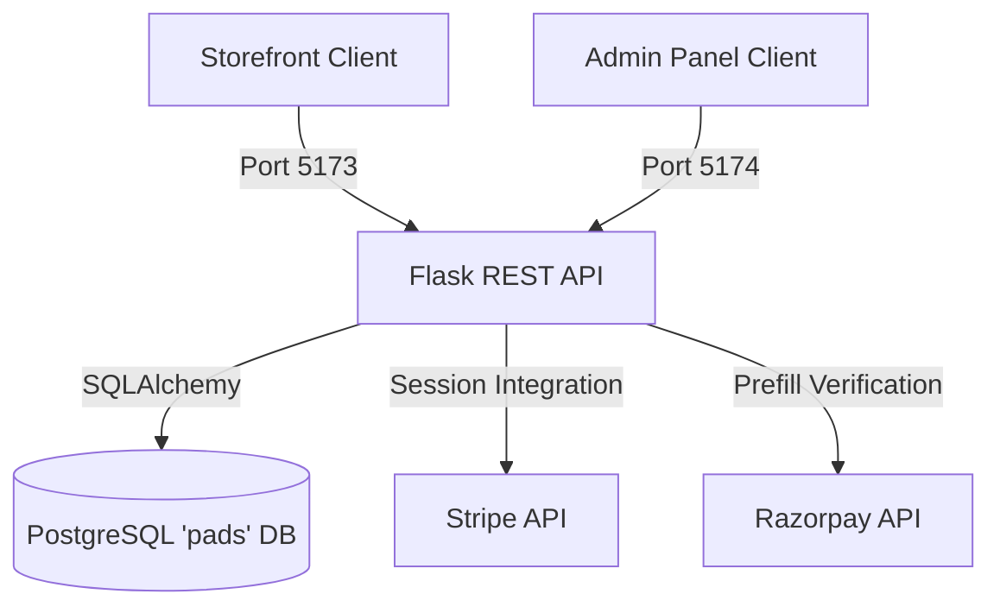

<<<<<<< HEAD
   # JIYONI | Premium Organic Women's Hygiene E-Commerce Platform

This repository houses a premium, fully animated, modular e-commerce application for **JIYONI**, a luxury women's hygiene brand.

## Project Architecture & Tech Stack



### 1. Frontend Client Storefront (`frontend/`)
- **Core:** React, TypeScript, Vite, Tailwind CSS.
- **Animations:** Framer Motion (fade-ins, slide drawer transitions, micro-interactions, state updates counters).
- **Libraries:** React Router DOM (v7), Axios (token intercepts), React Hook Form.

### 2. Administrative Control Portal (`admin/`)
- **Core:** Flat, clean React TS + Vite + Tailwind dashboard.
- **Capabilities:** Operational KPIs, graphical revenue charts, products CRUD, inventory level thresholds warnings, reviews moderation gates, faq configurations, and subscriber export lists.

### 3. Backend REST Server (`backend/`)
- **Core:** Python Flask, Flask-SQLAlchemy (fully connected to the `pads` PostgreSQL database), Flask-JWT-Extended, Flask-CORS, Flask-Bcrypt, Flask-Migrate.
- **REST Endpoints:** Swagger Interactive UI documentation built-in and served at `/api/docs`.

---

## Installation & Startup

### Step 1: Database Setup (PostgreSQL)
1. Ensure your PostgreSQL service is running locally on port `5432`.
2. Create the target database `pads`:
   ```sql
   CREATE DATABASE pads;
   ```
3. Load the SQL schema definitions and dummy seed dataset from `backend/database/schema.sql`:
   ```bash
   psql -U postgres -d pads -f backend/database/schema.sql
   ```

### Step 2: Backend Server Startup
1. Move to the backend folder directory:
   ```bash
   cd backend
   ```
2. Create and run a python virtual environment:
   ```bash
   python -m venv venv
   # On Windows:
   venv\Scripts\activate
   ```
3. Install required libraries:
   ```bash
   pip install flask flask-sqlalchemy flask-jwt-extended flask-cors flask-bcrypt flask-migrate psycopg2 dotenv stripe
   ```
4. Create a `.env` file from `.env.example` and replace credentials (database URL, payment keys, etc.).
5. Boot up the server:
   ```bash
   python app.py
   ```
   *The Flask backend REST API will run at http://localhost:5000.*

### Step 3: Frontend Storefront Startup
1. Move to the storefront folder:
   ```bash
   cd frontend
   ```
2. Install client dependencies:
   ```bash
   npm install
   ```
3. Launch the development server:
   ```bash
   npm run dev
   ```
   *Storefront interface will run at http://localhost:5173.*

### Step 4: Admin Dashboard Startup
1. Move to the admin folder:
   ```bash
   cd admin
   ```
2. Install admin client dependencies:
   ```bash
   npm install
   ```
3. Launch the admin dashboard server:
   ```bash
   npm run dev
   ```
   *Admin console will run at http://localhost:5174.*

---

## Administrative & Testing Credentials

To test user and admin checkout flows easily, use the following local credentials:

- **Customer Storefront Sign In:**
  - Email: `customer@jiyoni.com`
  - Password: `customer123`

- **Executive Administration Log In:**
  - Email: `admin@jiyoni.com`
  - Password: `admin123`


---

## Interactive REST Documentation
Boot up the Flask backend and visit:
👉 **[http://localhost:5000/api/docs](http://localhost:5000/api/docs)** to view the CDN-driven Swagger/OpenAPI documentation.
=======
# pads
>>>>>>> a770f563eae79fd77efaba10cb38accec6977235
